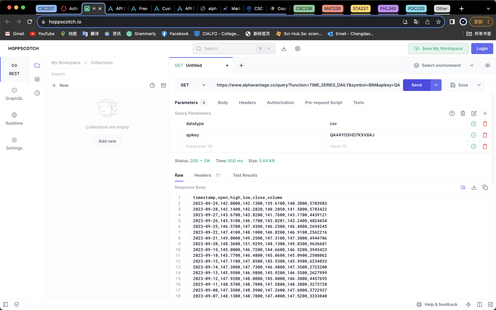

# Week 3 Project
Team members: Edison Lin, Micheal He, Manskim Quan and William Meng

# Problem Domain

### Our focus is to bring algorithmic trading with real-time market data to stock traders. Enabling automated trading with expert precision and risk management.

# Description

- Use of API’s to provide current and past data
- Allow users to simulate their trading strategies on past data as well as simulate in the real market on live data
- Graphical user interface that provides the most important data to the user
- Tools that allow for analysis of past trends and apply to the current market
- Risk warnings through analysis of accounting, managerial and news sources


# API’s

### Alpha Vantage - [https://www.alphavantage.co/documentation/](https://www.alphavantage.co/documentation/)

An example of getting stock quote for IBM using Alpha Vantage api.
### Twelve Data - [https://twelvedata.com/docs#getting-started](https://twelvedata.com/docs#getting-started)
 \
An example of a get request that returns the price of the stock price for the period desired in the request. The response is in CSV format. 
The API key was part of the request.

### Polygon - [https://polygon.io/docs/stocks/getting-started](https://polygon.io/docs/stocks/getting-started)


### IEX - [https://iexcloud.io/docs/api/](https://iexcloud.io/docs/api/)
  
An example of getting stock Quote for Apple using IEX api.


# Code

We have used teh Tweleve Data API to get the stock price for the period desired in the request. The response is in JSON format.
To get an API key go to https://twelvedata.com/docs#getting-started signup and get the API key.
We have used external libraries to make the request and parse the response.


```